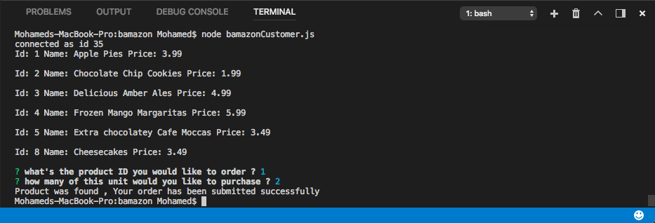
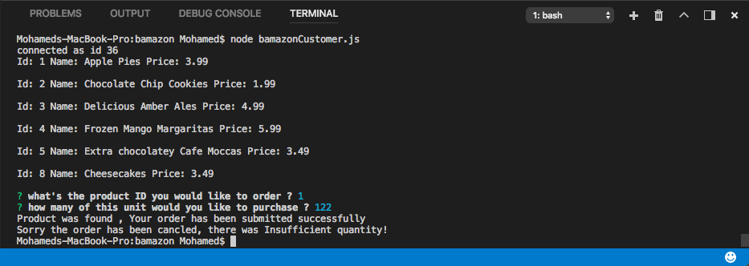

# Bamazon

In order to run this application, you should have the MySQL database already set up on your machine.
Once you have MySQL installed, you will be able to create the *Bamazon* database and the *products* table with the SQL code found in (bamazon.sql)

Bamazon uses these node modules: inquirer, mysql.

They are all dependencies in the package.json, so just run:

npm install

To run this module in the terminal:

node bamazonCustomer.js

Here's an image for the app when you run 
and succeffully find the product and made the order .

The other image here when the product not found in the database .

